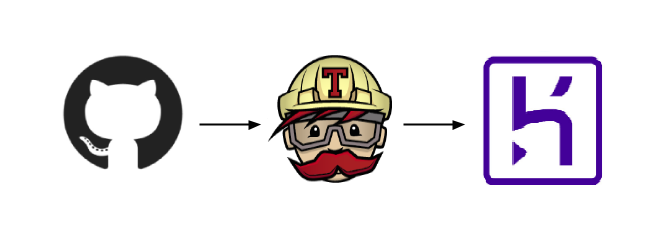

The following lines were written for future contributors to be able to pick up the project but any interested developer is welcome to read. If you are a recruiter lost on github, you should definitely hire me, or anyone else on the team.

# Description
Unify is an open source progressive web application to manage school events at ISEP. Among a lot of amazing features, it allows every student club to create and update events and every student to register to events. 

# Stack
Backend: [Ruby on Rails](https://rubyonrails.org/) </br>
Frontend: HTML, [Sass](https://sass-lang.com/), [Bootstrap](https://getbootstrap.com/) and ES6 JavaScript compiled with [Webpack](https://webpack.js.org/)</br>
Database: [Postgres](https://www.postgresql.org/) with [Active Record ORM](https://guides.rubyonrails.org/active_record_basics.html) </br>
Management: [Trello](https://trello.com/b/KvPE3ned/unify) and [Slack](https://app.slack.com/client/TKF4P6WH4/CKEPWD9AB) </br>

If you want to contribute, the stack is very easy to learn but you will need to be familiar with the [MVC pattern](https://en.wikipedia.org/wiki/Model%E2%80%93view%E2%80%93controller). 

# Infrastructure
Continuous integration powered by [Travis CI](https://travis-ci.com/) and [Heroku](heroku.com). 



# Philosophy and core values
* Value user stories
* Make code reviews
* Seek for the highest performance
* Focus on security
* Code in english, write user ouputs in french
* Don't commit blocks of commented code
* Care about the end user
* Keep up dry code

# Style guide
* For the frontend, make use of Sass amazing features and write good looking ES6 JavaScript code following [Airbnb style guide](https://github.com/airbnb/javascript).
* For the backend, respect the [Rails doctrine](https://rubyonrails.org/doctrine/) and don't violate the MVC pattern.

# Setup for Rails and Postgres
If you don't have rails installed on your computer, click on your Operating System and follow the steps. If you're on Windows I recommand either install ubuntu in dual boot, run ubuntu in a VM or buy a [MacBook Pro](https://www.apple.com/fr/macbook-pro/?afid=p238%7Cs19SgiikC-dc_mtid_187079nc38483_pcrid_410429749888_pgrid_41257055459_&cid=aos-fr-kwgo-mac--slid---product-).
<table>
  <tr>
    <td>
      <a href="setup/macOS_setup.md">
        
      </a>
    </td>
    <td>
      <a href="setup/ubuntu_setup.md">
        
      </a>
    </td>
  </tr>
</table>

# Starting with Rails
[Documentation](https://guides.rubyonrails.org/getting_started.html) </br>
[Rails repository](https://github.com/rails/rails)

# Workflow
Follow the [Github flow](https://guides.github.com/introduction/flow/)

# Reviews
To review someone's code, fetch the latest changes and checkout to the feature's branch.
```bash
git fetch
git checkout sexy-feature
```
Then make sure everything works like expected and the code is clean. Comment the PR to discuss improvements and merge if the build succeeds. Don't forget to delete the branch afterwards.

# HTML Structure
```
<div class="container-fluid spacer">
    <div class="row">
        <div class="col">
            Code here 
        </div>
    </div>
</div>
```
